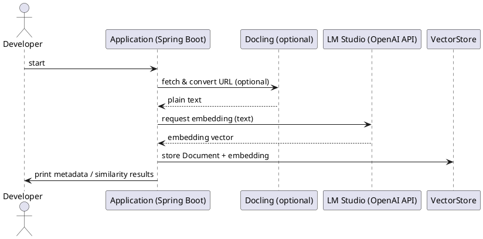

# Spring AI → LM Studio — Hello World embedding demo

This repository is a tiny "hello world" demo that shows how to connect Spring AI's OpenAI-compatible support to a locally running LM Studio instance to generate embeddings.

Overview
- Goal: demonstrate a minimal, reproducible flow where Spring AI calls an OpenAI-compatible LM Studio embedding endpoint and persists or inspects the returned embedding.
- Scope: a CommandLineRunner-based demo (non-web) that converts or provides text, requests embeddings, and prints/saves the result.

What this demo shows (quick)
1. Configure Spring AI to talk to an LM Studio OpenAI-compatible endpoint.
2. (Optional) Use Docling to fetch and convert a web page to plain text.
3. Use Spring AI's embedding support (OpenAI-compatible) to request an embedding vector.
4. Persist the result into a VectorStore (or just print metadata) and run a simple similarity check.

Why this is useful
- LM Studio exposes an OpenAI-compatible API; Spring AI's OpenAI-compatible client can call it with minimal configuration.
- This repo is intentionally small so you can reproduce the pieces needed to obtain embeddings and validate connectivity quickly.

Files / key artifacts
- `src/main/resources/application.yml`
  - Configuration for Spring AI (base URL, API key, embedding model id). Adjust to match your LM Studio instance.
- `src/main/java/io/forest/smartvalidator/Application.java`
  - Standard Spring Boot application entry point (non-web configuration recommended for the demo).
- `src/main/java/io/forest/smartvalidator/EmbeddingConfiguration.java`
  - Example beans (including a RestClient forcing HTTP/1.1) and a demo CommandLineRunner that uses Docling and the VectorStore.
- `src/main/java/io/forest/smartvalidator/DoclingDocumentReader.java`
  - A small helper that calls a local Docling server to convert a web page into plain text.
- `src/main/java/io/forest/smartvalidator/IngestionPipeline.java`
  - Simple ETL: extract (Docling) -> transform (TokenTextSplitter) -> load (VectorStore).
- `src/main/java/io/forest/smartvalidator/RagPipelineConfig.java`
  - Configuration that wires the demo ingestion pipeline to run on startup.

Prerequisites
- Java 17+ and Maven installed (or use your preferred JDK/Maven wrapper).
- LM Studio running locally and exposing an OpenAI-compatible endpoint (commonly at `http://localhost:1234/v1`).
- (Optional) Docling running locally if you want the demo's Docling-based web reader (`http://localhost:5001`).

Configuration example (`application.yml`)

```yaml
spring:
  main:
    web-application-type: none     # keep non-web to see CommandLineRunner output
  ai:
    openai:
      base-url: http://localhost:1234
      api-key: lm-studio
      embedding:
        options:
          model: text-embedding-nomic-embed-text-v1.5
```

Step-by-step guideline — steps taken in this demo

1) Prepare and confirm LM Studio
- Start LM Studio locally and ensure an embedding-capable model is loaded.
- Confirm LM Studio's OpenAI-compatible API is reachable (e.g. `http://localhost:1234/v1`).
- Note the model id returned by `GET /v1/models` and use it in `application.yml`.

2) (Optional) Start Docling if using the Docling-based reader
- Docling is used only for converting a remote web page to text (the project includes a Docling reader).
- If you don't want to run Docling, you can provide your own sample text instead of fetching a web page.

3) Force HTTP/1.1 when necessary
- Some local deployments (LM Studio or other model servers) may require HTTP/1.1. The project includes an example RestClient/HttpClient bean that forces HTTP/1.1. Enable it if you see protocol errors.

4) Build and run the demo
- Build the project and run the jar (or use `spring-boot:run`). Example (macOS zsh):

```bash
# package and run the jar
mvn -DskipTests package
java -jar target/smart-validator-1.0-SNAPSHOT.jar

# or run directly with the Spring Boot Maven plugin
mvn -DskipTests spring-boot:run
```

5) Verify LM Studio connectivity (optional)

```bash
curl -s -X GET "http://localhost:1234/v1/models" -H "Authorization: Bearer lm-studio" | head -n 200
```

6) Expected output
- If configured correctly the demo runner will print a short log showing the sample text and embedding metadata (vector length / dimension). If the repo is configured to persist embeddings, you'll also see VectorStore confirmation and a simple similarity query result.
- If LM Studio is unreachable or the model id is incorrect, the runner will log an error.

PlantUML sequence diagram (high-level flow)



Troubleshooting
- zsh: command not found: mvn — install Maven (`brew install maven` on macOS).
- Connection refused — ensure LM Studio (and Docling if used) are running on configured host/ports.
- model not found — verify the model id in `application.yml` matches a model from LM Studio's `/v1/models`.
- HTTP protocol errors — try forcing HTTP/1.1 for the RestClient used by Spring AI (see `RagPipelineConfig` / `EmbeddingConfiguration`).

Next steps / ideas
- Add a unit/integration test for the `EmbeddingTestRunner` with a mocked LM Studio response.
- Persist embeddings in a real vector DB (Chromadb, FAISS, etc.) and add integration tests for similarity search.

License
- Use and modify as needed for learning and development purposes.
